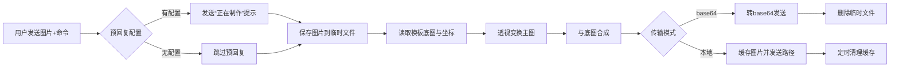

<div align="center">

# 🎨 创意截图
[](#)
[](#)
[](#)

> 将任意图片透视变形并合成到自定义模板 —— 轻松制作带壳截图、手持设备、创意卡片

</div>

---

## ✨ 特性一览

| 特性 | 说明 |
|------|------|
| 🖼️ **模板截图** | 将用户发送的图片透视变形到模板指定区域，与底图合成 |
| 📁 **模板系统** | 支持自定义模板（底图 + 四边形坐标配置） |
| 🚀 **高性能** | 异步处理 + 缓存清理，支持 base64 / 本地文件两种传输模式 |
| ⚙️ **灵活配置** | 可自定义预回复和完成回复的内容、引用、艾特方式 |
| 📋 **便捷命令** | 模板列表、模板预览、模板截图三大命令 |
| 🧩 **预设模板** | 内置 6 个精美模板（二次元1 + 美女手持1~5），开箱即用 |

---

## 📦 安装

### 1️⃣ 通过 AstrBot 商店安装（推荐）
- 进入 AstrBot 插件管理，点击右下角`+`，点击从链接安装
- 输入链接`https://github.com/landamao/abpl_cyjt`安装

### 2️⃣ 手动安装
```bash
cd AstrBot/data/plugins/
git clone https://github.com/landamao/abpl_cyjt.git 创意截图
```

### 3️⃣ 安装依赖
```bash
pip install -r requirements.txt
```
依赖包括：`Pillow`, `opencv-python`, `numpy`

---

## ⚙️ 配置说明

在 AstrBot 的插件配置界面可以调整以下选项：

| 配置项 | 类型 | 默认值 | 说明 |
|--------|------|--------|------|
| 🗣️ **预回复方式** | 多选列表 | `["提示词", "引用"]` | 可选：`提示词`、`引用`、`艾特`。留空则不发送预回复。 |
| 📝 **预回复词** | 文本 | `🎨 正在使用模板「{模板名}」制作，请稍等...` | 支持占位符 `{模板名}`。 |
| ✅ **完成回复方式** | 多选列表 | `["提示词", "引用", "艾特"]` | 同上，图片固定发送。 |
| 🏁 **完成回复词** | 文本 | `✅ 使用模板「{模板名}」生成成功` | 支持 `{模板名}`。 |
| 🔄 **base64传输** | 布尔 | `true` | `true`：图片转为 base64 发送（兼容性好）；`false`：发送本地路径（省内存）。 |

> 💡 **提示**：若取消勾选所有“预回复方式”，则不会发送任何预回复消息。

---

## 🎮 命令大全

### 1️⃣ 模板截图
```
/模板截图 <模板名>
```
或
```
/截图模板 <模板名>
```

**用法**：发送一条消息，**包含图片**（可回复图片消息），并附带上述命令。  
**示例**：
```
/模板截图 美女手持1
```
并同时发送一张你想合成的图片。

**效果**：插件将图片透视变形到模板的四边形区域内，与底图合成后返回。

---

### 2️⃣ 模板列表
```
/模板列表
```
或
```
/截图模板列表
/模板截图列表
```

**作用**：列出所有已加载的可用模板名称。

---

### 3️⃣ 模板预览
```
/模板预览 <模板名>
```
或
```
/预览模板 <模板名>
```

**作用**：发送该模板的底图 + 模板信息（尺寸、四个顶点坐标）。

**示例**：
```
/模板预览 二次元1
```

---

## 🧩 预设模板清单

插件自带以下 6 个模板（位于插件目录 `预设模板/` 下，首次启动会自动复制到数据目录）：

| 模板名 | 风格描述 |
|--------|----------|
| 🎭 **二次元1** | 二次元风格画框/屏幕合成 |
| 📱 **美女手持1** | 美女手持手机样式1 |
| 📱 **美女手持2** | 美女手持手机样式2 |
| 📱 **美女手持3** | 美女手持手机样式3 |
| 📱 **美女手持4** | 美女手持手机样式4 |
| 📱 **美女手持5** | 美女手持手机样式5 |

> 🔧 **扩展模板**：你可以手动在 `AstrBot/data/plugin_data/创意截图/模板目录` 下新建文件夹，放入 `底图.png` 和 `模板.json` 即可添加自己的模板。

---

## 🛠️ 自定义模板教程

### 📁 文件夹结构
```
模板目录/
└── 模板名/
    ├── 底图.png          # 背景底图（RGBA 或 RGB）
    └── 模板.json         # 四边形坐标配置文件
```

### 📄 模板.json 格式
```json
{
    "template_width": 1080,
    "template_height": 1920,
    "left_top_x": 150,
    "left_top_y": 400,
    "right_top_x": 930,
    "right_top_y": 400,
    "right_bottom_x": 930,
    "right_bottom_y": 1700,
    "left_bottom_x": 150,
    "left_bottom_y": 1700
}
```

| 字段 | 类型 | 说明 |
|------|------|------|
| `template_width` | int | 底图宽度（像素） |
| `template_height` | int | 底图高度（像素） |
| `left_top_x/y` | int | 左上角坐标 |
| `right_top_x/y` | int | 右上角坐标 |
| `right_bottom_x/y` | int | 右下角坐标 |
| `left_bottom_x/y` | int | 左下角坐标 |

> 📌 **注意**：四点顺序必须为 **左上 → 右上 → 右下 → 左下**（顺时针）。主图会被透视变换贴合到该四边形区域内。

---

## 📸 工作流程



---

## 🧹 缓存与清理

- 输出图片默认缓存 1 小时（`output_cache` 目录）
- 插件启动时会自动清理超过 1 小时的旧缓存
- 若使用 `base64传输` 模式，图片发送后立即删除临时文件

---

## ❓ 常见问题

### Q: 提示“未找到图片”？
**A**: 请确保发送的消息中包含图片，可以是直接发送的图片，也可以是回复一条包含图片的消息。

### Q: 提示“未找到名为 xxx 的模板”？
**A**: 先用 `/模板列表` 查看可用模板名，注意大小写和空格。

### Q: 合成后的图片位置不对？
**A**: 检查自定义模板的四边形坐标是否准确，建议先用 `/模板预览` 查看底图尺寸和坐标是否匹配。

### Q: 想要更快的回复速度？
**A**: 在配置中取消“预回复方式”的所有选项，或选择“引用”和“艾特”但不勾选“提示词”以减少文本发送开销。

---

## 📜 更新日志

### v1.5.0
- ✨ 新增 `模板预览` 和 `模板列表` 命令
- 🐛 修复 base64 传输模式下的内存占用问题
- ⚡ 优化预回复异步发送（使用 `yield`）
- 🧹 增加缓存自动清理机制

---

## 🤝 支持与反馈

- **作者**：懒大猫
- **仓库**：[https://github.com/landamao/abpl_cyjt](https://github.com/landamao/abpl_cyjt)
- **反馈**：欢迎提 Issue 或 Pull Request

---

<div align="center">
🎉 祝你使用愉快，创作出更多有趣的截图作品！
</div>
